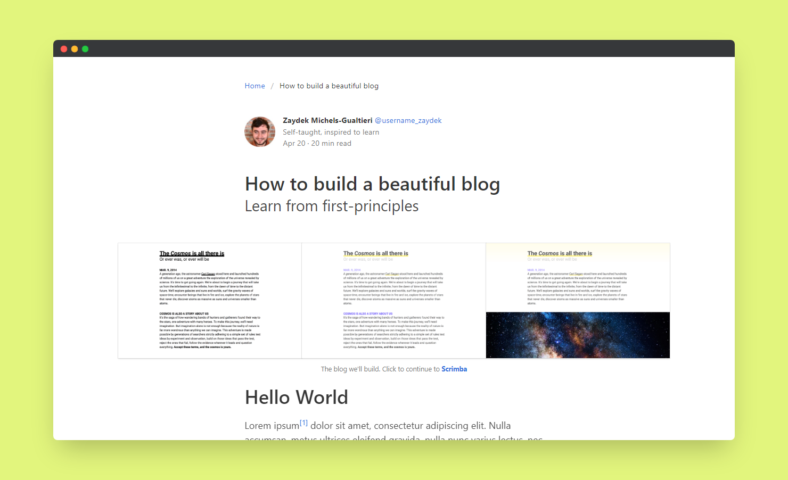

# Scrimba - Bulma how to build a blog solution

This is a solution to the [Bulma how to build a blog project on Scrimba](https://scrimba.com/learn/). Scrimba helps you improve your coding skills by building realistic projects.

## Table of contents

- [Overview](#overview)
  - [The challenge](#the-challenge)
  - [Screenshot](#screenshot)
  - [Links](#links)
- [My process](#my-process)
  - [Built with](#built-with)
  - [What I learned](#what-i-learned)
  - [Useful resources](#useful-resources)
- [Author](#author)
- [Acknowledgments](#acknowledgments)

## Overview

### The challenge

Users should be able to:

- See a beautiful responsive blog layout

### Screenshot



### Links

- Solution URL: [@GitHub](https://github.com/xdelmo/bulma-how-to-build-a-blog)

## My process

### Built with

- Semantic HTML5 markup
- CSS framework Bulma
- CSS custom properties
- Flexbox
- Mobile-first workflow

### What I learned

The newest thing I learnt is:

- How to divide page into columns with CSS Grid and create identifiers to use them into other classes

```css
.grid {
  display: grid;
  grid-template-columns:
    [xl-start] 1fr 1.5rem[md-start] minmax(0, 624px)
    [md-end]1.5rem 1fr [xl-end];
}

.grid * {
  grid-column: md;
}

.grid-xl {
  grid-column: xl;
}
```

### Useful resources

- [Bulma](https://bulma.io/) - Open source CSS framework that provides ready-to-use frontend components

## Author

- Website - [Emanuele Del Monte](https://www.emanueledelmonte.it)

## Acknowledgments

A big thank you to [Zaydek Gualtieri](https://twitter.com/username_zaydek)
